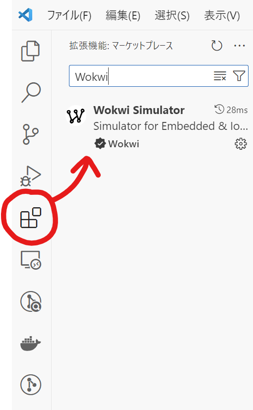
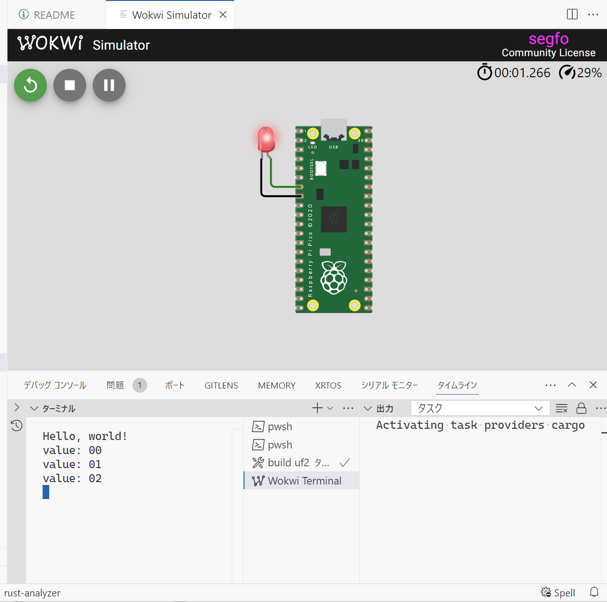

# はじめに
RustでRaspberry Pi Picoをno_stdで走らせるためのサンプルコードです。
オリジナルの方にREADMEが無いので、勝手に書いてるだけです。
導入の参考にどうぞ。

# 前提条件
1. Wokwi Simulatorプラグインをインストールします

2. 以下のコマンドで必須コマンドをインストールします(Cmakeが必要なので、必要時応じて[インストールします](https://qiita.com/matskeng/items/c466c4751e1352f97ce6))
    ```
    cargo install probe-rs-tools --locked
    cargo install flip-link elf2uf2-rs
    ```
3. `Ctrl+Shift+B` でビルドコマンドを走らせます。
    または以下のコマンドを実行します。（面倒なのでCtrl+Shift+Bのほうがおすすめです）
    このあたりの設定ファイルは`.vscode/tasks.json`に設定されています。
    ```
    cargo build
    elf2uf2-rs target/thumbv6m-none-eabi/debug/pico-wokwi-playground
    ```
4. `F1`もしくは`Ctrl+Shift+P`で`>Wokwi: Start Simulator`選択し、Wokwiシミュレータを起動します。


無事LEDがチカチカしてればOKです。